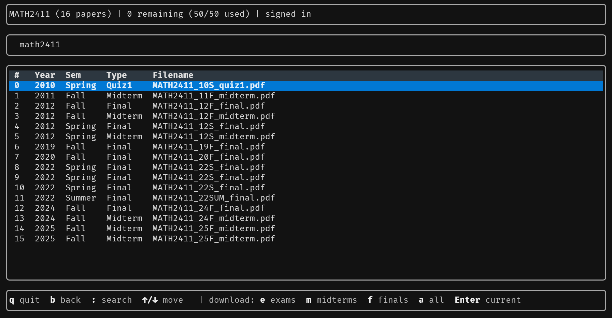

# Petergao CLI
A CLI wrapper for interacting with https://petergao.cc/ustpastpaper/index.php, written in Python.

## Features

- interactive TUI
- extensive commands
- better filenames
- never lost track of your quota

## Install

```bash
pip install -e .
```

## Usage

### Interactive UI

```bash
petergao
```

### Commands

```bash
petergao auth
petergao quota
petergao list COMP2011
petergao download COMP2011 --exams
petergao download COMP2011 --all --outdir ./papers
```

## Preview



## Remarks

- Sessions are stored in a local config file under your platform's config directory.
- The default output directory is your OS Downloads directory when it exists, otherwise the current directory.
- Use `--dry-run` to preview which files would be downloaded without spending quota.
